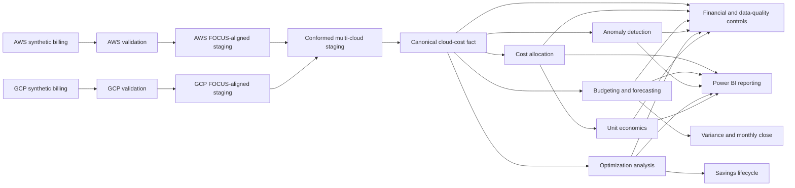

# Retail Co. FinOps Cost Management Platform

This project takes raw cloud billing data from AWS and GCP and turns it into something a finance or FinOps team can actually use: clean cost reporting, cost allocation to teams and apps, budgets and forecasts, anomaly detection, savings tracking, and unit economics.

Everything runs on synthetic data for a made-up retail company. The data is generated from a fixed seed, so the numbers are always the same when you run it. The results below show that the calculations and controls work—they are not real spend figures for a real business.

## What it does

Starting from provider billing exports, the platform walks the data through these steps:

1. Generate 12 months of AWS and GCP billing data.
2. Validate each provider's data on its own terms.
3. Normalize both into a shared FOCUS-aligned format.
4. Build one canonical cloud-cost table.
5. Allocate costs to apps, teams, environments, and cost centers, including shared platform costs.
6. Compare actual spend against budgets and forecasts.
7. Run the monthly close with accruals, journals, and reconciliation checks.
8. Detect unusual spending.
9. Find and track savings opportunities.
10. Connect cloud cost back to business activity through unit economics.
11. Present the results in a source-controlled Power BI report.

Every step reconciles back to the step before it, so totals never silently drift.

## Architecture



Detailed architecture notes are available in [`docs/architecture/current_architecture.md`](docs/architecture/current_architecture.md).

## The numbers from the modeled data

| What | Value |
| --- | ---: |
| AWS billing rows | 18,668 |
| GCP billing rows | 17,584 |
| AWS spend, 12 months | $97,227.68 |
| GCP spend, 12 months | $90,782.28 |
| Total cloud spend | $188,009.96 |
| Approved budget | $155,599.69 |
| Budget variance | $32,410.27 over budget (20.83%) |
| Costs allocated to a team or app | 93.39% |
| Costs left unallocated | 6.61% |
| Known anomalies detected | 6 of 6 |
| Commitment coverage | 33.70% |
| Commitment utilization | 92.22% |
| Business transactions | 11.89 million |
| Cost per transaction | $0.0158 |
| Reconciliation checks | PASS |
| Monthly-close checks | PASS |

## Savings

Savings are found by the optimization rules and then tracked through four stages, from first identified to realized.

| Stage | Per month | Per year |
| --- | ---: | ---: |
| Identified | $1,693.53 | $20,322.37 |
| Approved | $1,030.69 | $12,368.26 |
| Implemented | $869.76 | $10,437.17 |
| Realized | $739.30 | $8,871.60 |

Identified savings are about 10.81% of annual cloud spend. Realized savings are about 4.72%. Since the company is fictional, these are modeled outcomes, not money saved for anyone.

## Forecasting

The platform makes a one-month-ahead forecast each month and then checks it against what actually happened.

| Measure | Result |
| --- | ---: |
| One-month-ahead MAPE | 14.08% |
| WAPE | 12.67% |
| Forecast bias | -0.77% |
| Total actual-versus-forecast variance | 0.78% |

Across the full year, forecast spend lands within 0.78% of actual spend because months forecast too high partly cancel months forecast too low. Looking month by month, the average error is 14.08% (MAPE). The near-zero bias means the forecast is not consistently high or low—the error is mainly in the size of the monthly swings, not the direction.

## Power BI report

The [`powerbi/`](powerbi/) folder contains the full Power BI project as PBIP source: the semantic model, DAX measures, relationships, and four report pages.

### 1. Executive Overview

Shows total spend, approved budget, forecast, savings, allocation coverage, provider mix, top applications, and a short management-focused summary.


### 2. Cost Drivers & Unit Economics

Explains what changed in cloud cost and whether business efficiency improved. It includes service-level spend, month-over-month movement, variance decomposition, transaction volume, and cost per transaction.


### 3. Forecast Backtesting & Variance

Compares historical forecast versions with actual spend and shows forecast error, provider accuracy, and monthly forecast trends.


### 4. Optimization & Controls

Shows optimization opportunities, the savings lifecycle, commitment coverage and utilization, anomaly detection, monthly-close checks, and financial data quality.


## How it is built

The data moves through five BigQuery datasets:

| Dataset | What lives here |
| --- | --- |
| `retail_finops_raw` | Landing tables straight from the providers |
| `retail_finops_staging` | Normalization and FOCUS conformance |
| `retail_finops_core` | The canonical cost fact and shared dimensions |
| `retail_finops_mart` | Allocation, planning, anomaly, optimization, and unit economics |
| `retail_finops_control` | Reconciliation and quality checks |

Repository folders:

```text
config/          Business dimensions, pricing, mappings, and assumptions
generator/       Builds the AWS, GCP, and business-activity data
validation/      Checks each provider's source data
normalization/   FOCUS-aligned normalization for local validation
sql/             BigQuery logic grouped by platform stage
scripts/         BigQuery runners and repository checks
tests/           Automated tests
data/            Generated synthetic data and control outputs
powerbi/         Power BI model and report as PBIP source
docs/            Architecture, screenshots, and methodology notes
```

## A few design choices worth knowing

**AWS and GCP are kept separate until it is safe to combine them.** AWS payer and usage accounts are not the same as GCP billing accounts and projects, so they stay distinct through validation and normalization. Shared dimensions are created only after each provider is processed on its own terms.

**Bad records are flagged, not deleted.** Duplicates, invalid usage, missing owners, and late-arriving records are kept and marked. Flags decide which records count toward financial reporting, so nothing disappears without a trace.

**GCP nested data is handled carefully.** GCP credits are expanded separately from labels so a record cannot be multiplied and overstate cost.

**Fact tables do not join directly to each other.** They share dimensions instead. This stops the same dollars from being counted twice when tables are stored at different levels of detail.

## Run it locally

You will need Python.

### Windows PowerShell

```powershell
python -m venv .venv
.\.venv\Scripts\Activate.ps1
python -m pip install -r requirements-dev.txt
```

### macOS or Linux

```bash
python3 -m venv .venv
source .venv/bin/activate
python -m pip install -r requirements-dev.txt
```

Generate the data, validate it, normalize it, and run the repository checks:

```bash
python -m generator.aws_billing_generator
python -m generator.gcp_billing_generator
python -m validation.run_source_validation
python -m normalization.run_focus_normalization
python scripts/run_repo_ci.py
```

The BigQuery steps run through the PowerShell scripts in `scripts/`. Windows users can run them directly. On macOS or Linux, install PowerShell 7 and run the same scripts with `pwsh`.

```bash
pwsh ./scripts/run_bigquery_allocation.ps1
```

## The controls behind it

The platform is built so mistakes get caught instead of shipped:

- Source totals have to match normalized totals.
- Normalized totals have to match the canonical cost table.
- Allocation cannot add or lose a dollar.
- Every journal has to balance.
- Every reversal has to point back to its original accrual.
- Variance has to add up to the actual cost change.
- Savings have to move through the stages in order.
- Known anomalies have to stay detectable.
- Unit-economics cost and activity periods have to line up.
- Failed checks stop milestone completion.

## What this is and is not

This project demonstrates real-world billing structures, FinOps workflows, and financial controls using deterministic synthetic data.

It does not claim to be live production billing, real enterprise spend, production scheduling, production identity or secret management, or savings actually banked by a real company.

See [`CONTRIBUTING.md`](CONTRIBUTING.md) for how the project is developed and reviewed. Commits are made only after the work and its controls have run—there are no empty commits or fake dates used to pad activity.
