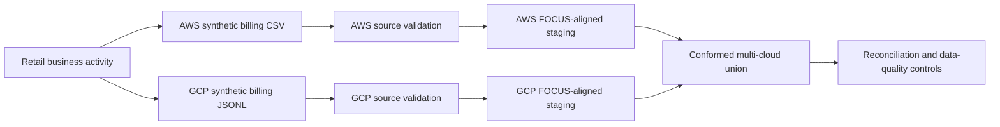

# Retail Co. FinOps Cost Management Platform

**Current release:** Synthetic multi-cloud billing foundation  
**Scope completed:** Configuration → AWS generator → GCP generator → source validation → FOCUS-aligned staging → reconciliation

Retail Co. needs a trusted view of AWS and GCP consumption that preserves provider-specific billing behavior, identifies data-quality issues, and reconciles every normalized financial total back to source.

## What is complete

- Twelve contiguous months of deterministic retail business activity
- AWS CUR/Data Export-style synthetic billing
- GCP BigQuery Billing Export-style nested JSONL billing
- Separate AWS and GCP source validation
- Traceable duplicates, missing attribution, invalid usage, late arrivals, credits, refunds, adjustments, taxes, commitment fees, and injected anomalies
- Independent AWS and GCP FOCUS-aligned normalization
- One child normalized row per nested GCP credit
- Provider and all-cloud financial reconciliation
- Automated tests for configuration, generation, validation, normalization, and reconciliation

## Current modeled results

| Control | Result |
|---|---:|
| AWS source rows | 18,668 |
| GCP source rows | 17,584 |
| AWS FOCUS-aligned rows | 18,668 |
| GCP FOCUS-aligned rows | 18,715 |
| AWS billed-cost control | $96,427.34 |
| GCP net-cost control | $89,841.26 |
| All-cloud net-cost control | $186,268.60 |
| Reconciliation variance | $0.00 |
| Normalization status | PASS |

These are modeled results produced from seeded synthetic data. They are not claims about a real company’s cloud spend.

## Architecture



Detailed architecture: [`docs/architecture/current_architecture.md`](docs/architecture/current_architecture.md)

## Provider-specific design decisions

### Billing hierarchy

- AWS payer and usage accounts remain separate.
- GCP billing accounts and projects remain separate.
- AWS usage accounts and GCP projects are not presented as native equivalents.

### Charge classification

- AWS line-item types remain available in `charge_class`.
- GCP `cost_type` values and nested credit types remain available in `charge_class`.
- Both providers map into controlled common `charge_category` values only after independent processing.

### GCP nested data

- Projects remain structures.
- Labels remain repeated arrays in the source.
- Credits remain repeated arrays in the source.
- Labels are extracted without row expansion.
- Credits are expanded separately to prevent cross-UNNEST row multiplication.

## Repository structure

```text
config/          Generator assumptions, dimensions, mappings, prices and validation rules
generator/       Shared business activity plus separate AWS and GCP generators
validation/      Provider-specific source controls and exception reporting
normalization/   Local runner for SQL-first FOCUS-aligned staging
sql/staging/     Independent AWS and GCP normalization plus post-conformance union
sql/controls/    Reconciliation and data-quality controls
tests/           Automated configuration, generator, validation and normalization tests
data/            Generated synthetic source data and reproducible control outputs
docs/            Architecture and evidence-capture instructions
```

## Run locally

### 1. Activate the environment

```powershell
.venv\Scripts\Activate.ps1
```

### 2. Generate both providers

```powershell
python -m generator.aws_billing_generator
python -m generator.gcp_billing_generator
```

### 3. Validate source data

```powershell
python -m validation.run_source_validation
```

### 4. Normalize and reconcile

```powershell
python -m normalization.run_focus_normalization
```

### 5. Run tests and repository checks

```powershell
python -m pytest
python scripts\repository_quality_check.py
```

## Expected control results

Source validation should report:

```text
AWS net cost:       $96,427.338147
GCP net cost:       $89,841.260397
All-cloud control: $186,268.598544
Billing rows combined at source stage: False
```

FOCUS-aligned normalization should report:

```text
AWS normalized independently: True
GCP normalized independently: True
Union performed after conformance: True
Overall status: PASS
Reconciliation variance: $0.00
```

## Data-quality policy

Source defects are preserved and flagged rather than silently deleted. Financial reporting uses explicit canonical/validity indicators so duplicates and invalid records remain auditable.

Expected source exceptions include:

- Missing AWS business tags
- Missing GCP business labels
- Duplicate source-record IDs
- Invalid negative usage
- Late-arriving records

Injected consumption spikes are valid billing events, not data-quality failures.

## Honest scope boundary

Not yet built:

- Cloud warehouse deployment
- Final cloud-cost fact table and dimensions
- Shared-cost allocation and chargeback
- Budgeting, forecasting and monthly close
- Algorithmic anomaly management
- Optimization and savings lifecycle
- Unit economics
- Excel financial model
- Power BI reporting
- Production automation

This repository currently demonstrates the controlled synthetic billing and normalization foundation only.

## Development integrity

Milestones are committed only after genuine review, meaningful improvement, test execution, and output inspection on the actual commit date. Commit dates, system dates and empty commits are not manipulated to manufacture activity. See [`CONTRIBUTING.md`](CONTRIBUTING.md).
