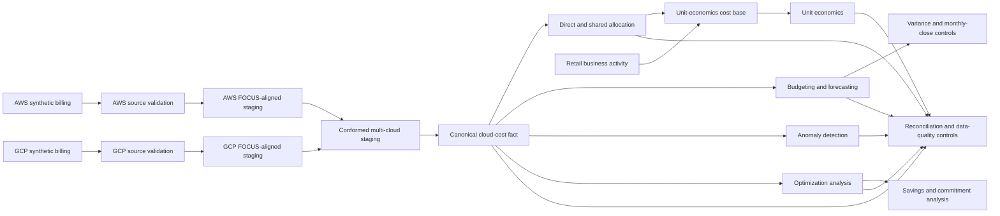
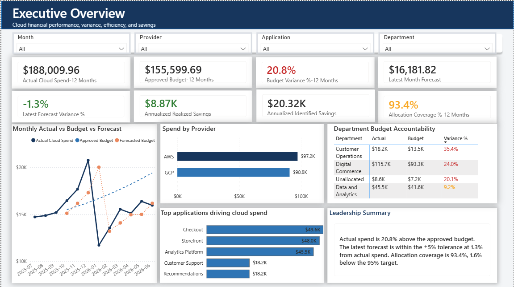
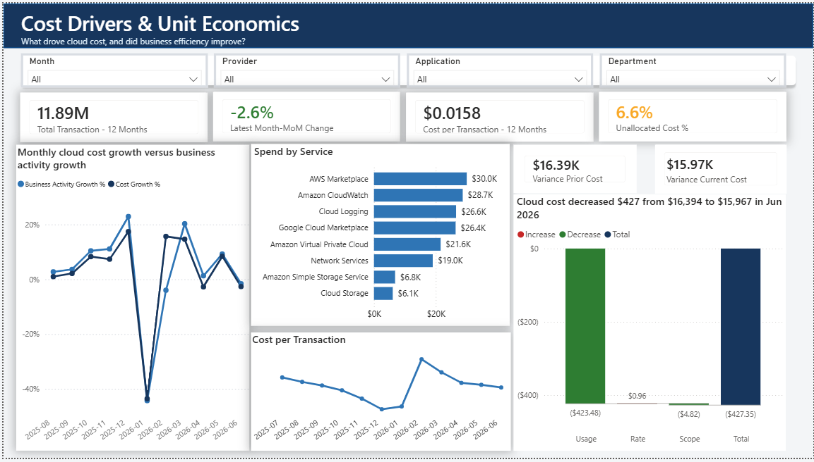
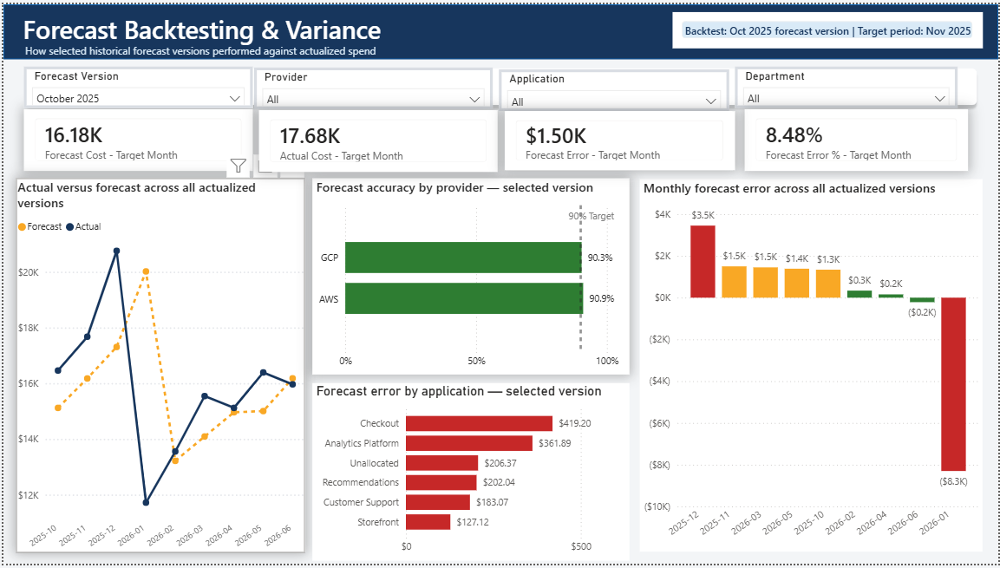
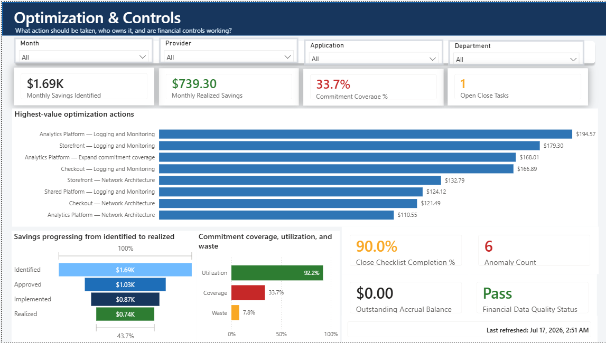

# Retail Co. FinOps Cost Management Platform

A portfolio-grade FinOps platform that converts modeled AWS and GCP billing data into trusted cost reporting, allocation, financial planning, anomaly detection, optimization recommendations, and business unit economics.

The project uses deterministic synthetic data for a fictional retail company. The financial results demonstrate the platform’s calculations and controls; they are not claims about a real company’s cloud spend or savings.

## Current release

**Completed scope:** Milestones 0–15

```text
Configuration
→ AWS and GCP billing generation
→ Source validation
→ FOCUS-aligned normalization
→ Canonical cloud-cost fact
→ Direct and shared allocation
→ Budgeting and forecasting
→ Variance analysis
→ Monthly-close controls
→ Anomaly detection
→ Optimization and savings lifecycle
→ Business activity and unit economics
```

**Power BI status:** The semantic model and report are currently under development and are not included in this released milestone.

## Business problem

Retail Co. operates workloads across AWS and GCP but lacks a single trusted financial view of its cloud consumption.

The company needs to:

- preserve provider-specific billing behavior;
- reconcile financial totals back to source data;
- assign costs to accountable teams and applications;
- allocate shared platform costs;
- compare actual spend with budgets and forecasts;
- explain cost changes through usage, rate, and scope;
- detect unusual spending patterns;
- identify and track savings opportunities;
- evaluate commitment coverage and utilization;
- connect cloud cost to business activity.

This project builds the data and control layer needed to answer those questions.

## Architecture



Detailed architecture is available in [`docs/architecture/current_architecture.md`](docs/architecture/current_architecture.md).

## What has been built

### Synthetic billing foundation

- Twelve contiguous months of modeled retail activity
- Deterministic, seeded data generation
- AWS CUR/Data Export-style billing records
- GCP BigQuery Billing Export-style nested JSONL records
- Provider-specific accounts, projects, services, resources, SKUs, regions, and pricing
- Credits, refunds, taxes, fees, adjustments, commitment charges, and late-arriving records
- Traceable duplicates, invalid usage records, missing attribution, and injected cost anomalies

### Validation and normalization

- Independent AWS and GCP source validation
- Provider-specific billing behavior preserved before conformance
- FOCUS-aligned normalization
- Separate expansion of nested GCP credits
- Canonical-record and financial-validity indicators
- Provider-level and all-cloud reconciliation
- Auditable data-quality exception reporting

### Cost allocation

- Direct cost attribution
- Shared-cost allocation
- Application, department, environment, owner, and cost-center assignment
- Allocation coverage and unallocated-cost reporting
- Reconciliation between source cost and allocated cost

### Financial planning and monthly close

- Monthly actual-cost marts
- Approved budgets
- Versioned one-month-ahead forecasts
- Forecast accuracy and bias measurement
- Budget variance analysis
- Usage, rate, and scope variance decomposition
- Accruals and reversals
- Reclassification journals
- Chargeback journals
- Monthly-close checklist and financial controls

### Anomaly detection

- Daily cost baselines
- Absolute and relative variance analysis
- Warning and critical severity thresholds
- Traceability from anomaly summaries back to source records
- Six deliberately injected and successfully detected anomalies

### Optimization and savings management

- Rightsizing and scheduling opportunities
- Storage and operational-waste recommendations
- Commitment coverage and utilization analysis
- On-demand and commitment-covered cost analysis
- Recommendation prioritization
- Savings overlap controls
- Savings lifecycle tracking from identified through realized

### Unit economics

- Monthly business-activity modeling
- Transaction and API-request volumes
- Active-customer and revenue metrics
- Cost per transaction
- Cost per active customer
- Cost per API request
- Monthly trends and prior-period comparisons

## Current modeled results

### Reporting periods

- **Cloud cost:** July 1, 2025 through June 30, 2026
- **Unit economics:** July 2025 through June 2026
- **Forecast evaluation:** Nine actualized one-month-ahead forecasts

### Financial and operational results

| Metric | Modeled result |
|---|---:|
| AWS source rows | 18,668 |
| GCP source rows | 17,584 |
| AWS canonical actual spend | $97,227.68 |
| GCP canonical actual spend | $90,782.28 |
| All-cloud actual spend — 12 months | $188,009.96 |
| Approved budget — 12 months | $155,599.69 |
| Budget variance | $32,410.27 unfavorable |
| Budget variance percentage | 20.83% unfavorable |
| Allocation coverage | 93.39% |
| Unallocated cost percentage | 6.61% |
| Detected known anomalies | 6 of 6 |
| Commitment coverage | 33.70% |
| Commitment utilization | 92.22% |
| Total business transactions | 11.89 million |
| All-cloud cost per transaction | $0.0158 |
| Financial reconciliation status | PASS |
| Monthly-close data-quality status | PASS |

## Savings lifecycle

Savings values are generated by the optimization rules and tracked through four operational stages.

| Savings stage | Monthly result | Annualized result | Annual target | Status |
|---|---:|---:|---:|---|
| Identified | $1,693.53 | $20,322.37 | $15,000+ | Favorable |
| Approved | $1,030.69 | $12,368.26 | $12,000+ | Favorable |
| Implemented | $869.76 | $10,437.17 | $9,000+ | Favorable |
| Realized | $739.30 | $8,871.60 | $7,500+ | Favorable |

Identified opportunities equal approximately **10.81% of annual cloud spend**, while annualized realized savings equal approximately **4.72%**.

Because Retail Co. is fictional, these are modeled opportunities and modeled lifecycle outcomes—not claims that money was saved for a real organization.

## Forecast performance

| Forecast metric | Result |
|---|---:|
| One-month-ahead MAPE | 14.08% |
| Forecast WAPE | 12.67% |
| Forecast bias | -0.77% |
| Aggregate actual-versus-forecast variance | 0.78% |
| MAPE target | Below 10% |
| Target status | TARGET_MISSED |

The aggregate forecast is close to actual spend because monthly overforecasts and underforecasts partially offset each other. However, the one-month-ahead MAPE remains above the target.

The honest conclusion is that forecasting has improved from the modeled starting position but still requires refinement.

## Key design decisions

### Provider billing hierarchies remain separate

AWS payer accounts and usage accounts are not treated as direct equivalents of GCP projects.

- AWS payer and usage-account fields remain distinct.
- GCP billing accounts and projects remain distinct.
- Common dimensions are created only after provider-specific processing.

### Provider charge classifications are preserved

AWS line-item types and GCP cost and credit types remain available for auditability.

They are mapped into common charge categories only after the original provider classifications have been retained.

### GCP nested records are handled safely

GCP labels and credits remain nested in the source representation.

Credits are expanded separately from labels to prevent cross-join multiplication and financial overstatement.

### Source defects remain auditable

Duplicates, invalid usage, missing attribution, and late-arriving records are preserved and flagged rather than silently deleted.

Canonical and financial-validity fields control which records contribute to financial reporting.

### Fact tables do not filter each other

The analytical design uses shared dimensions and controlled marts instead of direct fact-to-fact relationships.

This prevents duplicate financial totals when tables have different grains.

## BigQuery datasets

| Dataset | Purpose |
|---|---|
| `retail_finops_raw` | Provider landing tables and ingestion controls |
| `retail_finops_staging` | Provider normalization and FOCUS-aligned conformance |
| `retail_finops_core` | Canonical cloud-cost fact and shared dimensions |
| `retail_finops_mart` | Allocation, planning, anomaly, optimization, and unit-economics marts |
| `retail_finops_control` | Reconciliation and data-quality control outputs |

## Repository structure

```text
config/                Business dimensions, mappings, prices, and assumptions
generator/             Deterministic AWS, GCP, and business-activity generation
validation/            Provider-specific validation and exception reporting
normalization/         Local FOCUS-aligned normalization utilities

sql/raw/               BigQuery landing-layer definitions
sql/staging/           AWS and GCP normalization and conformed staging
sql/core/              Canonical cloud-cost fact
sql/allocation/        Direct and shared allocation logic
sql/planning/          Actuals, budgets, forecasts, variance, and monthly close
sql/anomaly/           Cost-series preparation, scoring, and anomaly marts
sql/optimization/      Recommendations, savings, and commitment analysis
sql/unit_economics/    Business-activity and unit-economics marts
sql/controls/          Reconciliation, quality, and financial controls

scripts/                BigQuery milestone runners and repository utilities
tests/                  Automated configuration, generator, and validation tests
data/                   Deterministic synthetic source data and control outputs
docs/                   Architecture, methodology, and supporting documentation
```

## Run locally

### 1. Create and activate the Python environment

```powershell
python -m venv .venv
.venv\Scripts\Activate.ps1
pip install -r requirements.txt
```

### 2. Generate the AWS and GCP source data

```powershell
python -m generator.aws_billing_generator
python -m generator.gcp_billing_generator
```

### 3. Validate the generated source files

```powershell
python -m validation.run_source_validation
```

### 4. Run local normalization and reconciliation

```powershell
python -m normalization.run_focus_normalization
```

### 5. Run automated tests

```powershell
python -m pytest
```

### 6. Run repository-quality checks

```powershell
python scripts\repository_quality_check.py
```

BigQuery transformations are executed through the milestone-specific PowerShell runners in the `scripts/` directory. Each runner executes its SQL dependencies and associated controls in order.

## Control philosophy

The project follows several financial-control principles:

- Source totals must reconcile to normalized totals.
- Normalized totals must reconcile to the canonical cost fact.
- Allocation must not create or destroy cost.
- Journals must balance.
- Reversals must link to their original accruals.
- Variance decomposition must reconcile to the total cost change.
- Savings stages must follow the correct lifecycle order.
- Known anomalies must remain detectable.
- Unit-economics cost and business-activity periods must align.
- Failed controls stop milestone completion.

## Power BI status

The Power BI semantic model and report are the next development milestone.

The planned source-controlled Power BI project includes:

- TMDL semantic-model definitions
- DAX measures
- Dimension-to-fact relationships
- Executive reporting
- Financial planning and variance analysis
- Optimization and savings reporting
- Unit economics and control reporting
- A dedicated measure-QA page

Power BI results will be committed only after model reconciliation, measure validation, and visual QA are complete.

## Scope boundary

This repository demonstrates enterprise-grade billing structures, FinOps workflows, and financial controls using deterministic synthetic data.

It does not currently claim:

- enterprise spend volume;
- live production billing ingestion;
- production scheduling or orchestration;
- production identity and secret management;
- operational service-level objectives;
- automated remediation of optimization recommendations;
- savings realized for a real company.

## Power BI report pages

The Power BI project is included in `/powerbi` as a PBIP source project.

### 1. Executive Overview
This page summarizes 12-month actual spend, approved budget, latest forecast, savings, and allocation coverage. It also shows provider mix, top applications driving spend, and a short leadership summary.



### 2. Cost Drivers & Unit Economics
This page explains what changed in cloud cost and whether business efficiency improved. It includes transaction volume, month-over-month change, cost per transaction, unallocated cost percentage, service-level spend, and variance decomposition.



### 3. Forecast Backtesting & Variance
This page evaluates forecast performance using selected historical forecast versions against actualized spend. It includes target-month forecast versus actual, forecast error, provider accuracy, and monthly forecast error trends.



### 4. Optimization & Controls
This page shows optimization opportunities, savings progression from identified to realized, commitment coverage and utilization, anomaly count, close-checklist completion, outstanding accrual balance, and overall financial data quality.




