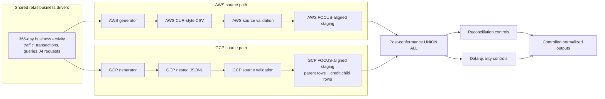

# Current Architecture — Synthetic Billing Foundation



## Grain by layer

| Layer | Grain |
|---|---|
| AWS source | One row per AWS billing line item |
| GCP source | One row per GCP billing export record with nested labels and credits |
| AWS staging | One row per AWS source billing line item |
| GCP staging | One parent row per GCP source record plus one child row per nested credit |
| Multi-cloud union | One row per conformed staging record after provider schemas match |

## Control sequence

```text
AWS source → AWS validation → AWS staging reconciliation
GCP source → GCP validation → GCP staging reconciliation
AWS staging + GCP staging → post-conformance union → all-cloud reconciliation
```

## Explicit non-equivalences

- AWS usage account is not presented as the native equivalent of a GCP project.
- AWS line-item type is not presented as a one-to-one equivalent of GCP `cost_type`.
- AWS credit rows are not processed like GCP nested credits.
- AWS flat exports are not processed like GCP nested/repeated exports.
